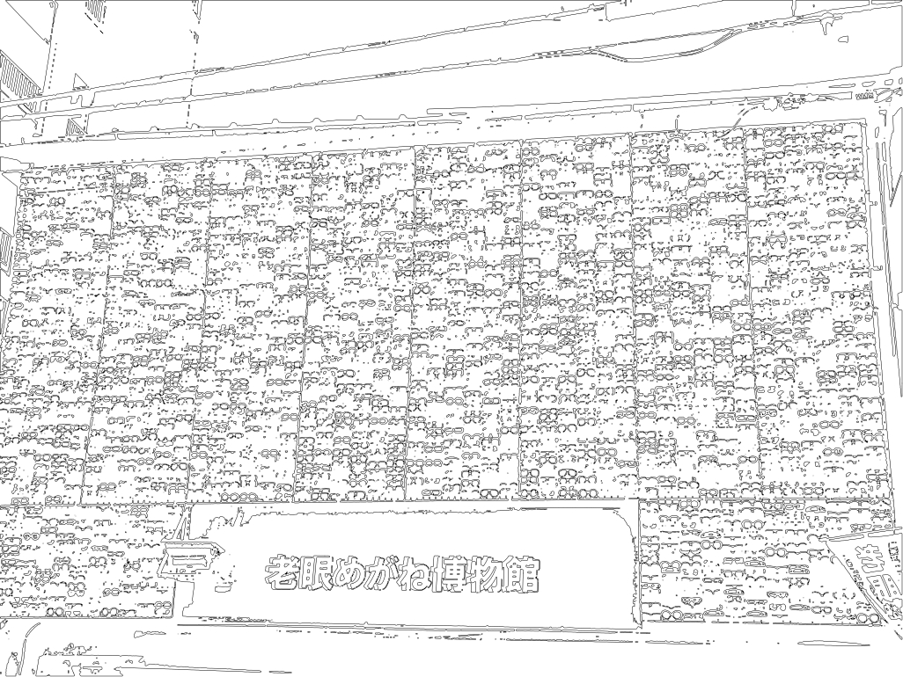

# go-image-contour

Opinionated Go package for working with the `fogleman/contourmap` package.

## Documentation

## Tools

$> make cli
go build -mod vendor -ldflags="-s -w" -o bin/contour cmd/contour/main.go
go build -mod vendor -ldflags="-s -w" -o bin/contour-svg cmd/contour-svg/main.go

### contour

### contour-svg

## See also

* https://github.com/aaronland/go-image
* https://github.com/fogleman/contourmap
* https://github.com/fogleman/gg